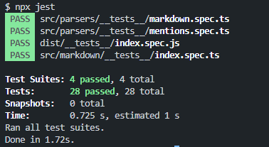

# Tg text formatter

Hello! It's another package for telegram text markdown

Here's the methods which can be useful for you if you don't wanna type markdown marking manually

## Installation

```bash
npm i tg-text-formatter
```

```bash
yarn add tg-text-formatter
```

## Tests of this library



## Ways to using

There are two ways how you can use this library

<ol>
    <li>Using classes</li>
    <li>Using methods</li>
</ol>

# TelegramMarkdown

## Using class

````ts
import { TelegramMarkdown } from "tg-formatter-text";

console.log(TelegramMarkdown.bold("idk")); // **idk**
console.log(TelegramMarkdown.cursive("idk")); // __idk__
console.log(TelegramMarkdown.boldCursive("idk")); // **__idk__**
console.log(TelegramMarkdown.crossedOut("idk")); // ~~idk~~
console.log(TelegramMarkdown.monospace("idk")); // `idk`
/**
 * Code with language
 */
console.log(TelegramMarkdown.code("console.log(`idk`)", "ts")); // ```ts\nidk```
/**
 * Code without language
 */
console.log(TelegramMarkdown.code("console.log(`idk`)")); // ```\nidk```
console.log(TelegramMarkdown.spoiler("idk")); // ||idk||
````

## Using methods

````ts
import {
    bold,
    cursive,
    boldCursive,
    crossedOut,
    monospace,
    code,
    spoiler,
} from "tg-formatter-text";

console.log(bold("idk")); // **idk**
console.log(cursive("idk")); // __idk__
console.log(boldCursive("idk")); // **__idk__**
console.log(crossedOut("idk")); // ~~idk~~
console.log(monospace("idk")); // `idk`
/**
 * Code with language
 */
console.log(code("console.log(`idk`)", "ts")); // ```ts\nidk```
/**
 * Code without language
 */
console.log(code("console.log(`idk`)")); // ```\nidk```
console.log(spoiler("idk")); // ||idk||
````
